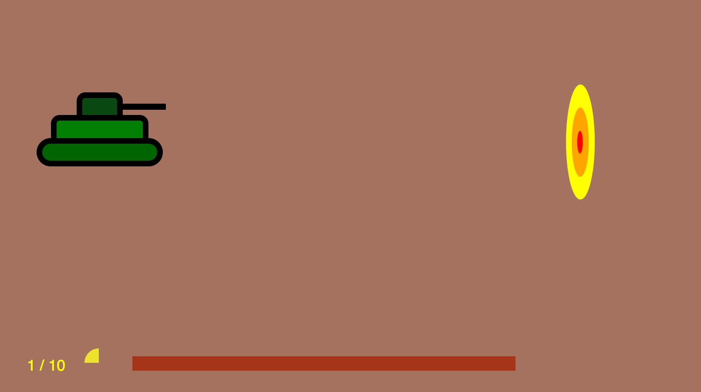

# Tank
A very simple tank game written in React.js for fun and teaching Jimmy something about programming.

## Controls
* S - move tank up
* X - move tank down
* D - point turret higher
* C - point turret lower
* Space - fire



## Development
Clone project and install deps 
```shell
git clone
cd tank
npm install
```

## Start dev server
```shell
npm run start
```

## Watch for SCSS changes
```shell
npm run watch
```

## Build for production
```shell
npm run build
```


